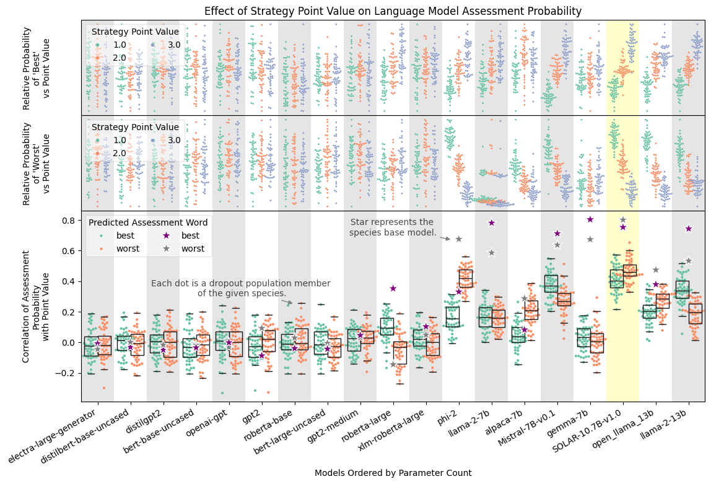

# Simple Value Assignment and Preference

This folder contains the simple value assignment and preference data and experiment.

The dataset is [here](rational.md) and the results for many different models is [here](data).

The results of the experiment can be seen below.

